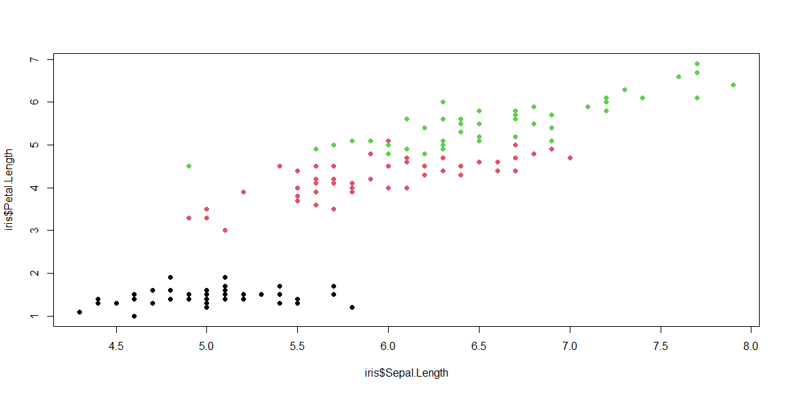

```r
# Use this R-Chunk to import all your datasets!
```

## Background

_Place Task Background Here_

## Data Wrangling


```r
# Use this R-Chunk to clean & wrangle your data!
```

## Data Visualization


```r
# Use this R-Chunk to plot & visualize your data!
plot(x = iris$Sepal.Length,
     y = iris$Petal.Length, 
     col = iris$Species, pch = 19)
```

<!-- -->

## Links for the Articles
1)https://pudding.cool/2021/03/covid-science/
2)https://pudding.cool/2021/01/cool/
3)https://ourworldindata.org/explorers/global-food?time=2019&facet=none&Food=Maize+%28Corn%29&Metric=Production&Per+Capita=false&country=~RUS


## Conclusions

**What is unique or good about the visualization? List a few ideas.**
1) The first article had a pretty cool graphic, because it was interactive and changed as you started scrolling down. The disproportion of the increase of coronavirus articles in 2020 is made very apparent by the bar graph.   

2)The chart is first thing on the page and really pulls your attention to it. It is very coloful. It is divided into seasons. There is a secondary chart that is a little more useful, because it tells us how the information is divided by person. 

3)This chart has different subsections to be able to organize the data that it has, because it has a lot of it. You can go through time and see the amounts of food that was produced all across the world.  

**What could be better? Identify at least one issue with the visualization.** 

1) The graph movement and change is pretty cool, but it assumes that the reader is going to keep reading until they get to the bottom of the page. Most people keep the part they are reasing in the center of the page. So the graph started changing before I was really ready for it. Then I had to backtrack and figure out what it waas trting to say. There are just a lot of information thrown at you on the chart. The title is smaller, than everything else.  

2) The first chart has a lot of information in it, but it is not very easy to determine how mant times it was said very easily. You would have to check the key everytime you wanted to add up an individual episode or season. There should have been more labeling for amounts. May have looked better as a barchart. 

3) The key could have been labeled better. I wasn't sure if it was supposed to be how much food was being produced or how many people needed to eat. Also it took me a second to find that the t meant tons, so it would have been nice if it said it somewhere clearly at the beginning.  
