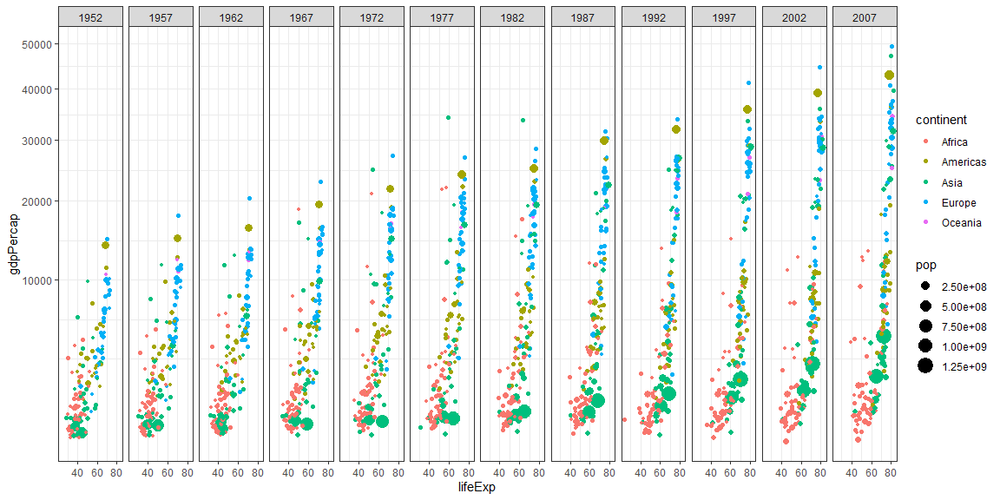

```r
# Use this R-Chunk to import all your datasets!
```

## Background

_Place Task Background Here_

## Data Wrangling


```r
# Use this R-Chunk to clean & wrangle your data!
new_data <-filter(gapminder, gapminder$country != "Kuwait")
```

## Data Visualization


```r
# Use this R-Chunk to plot & visualize your data!

ggplot(data = new_data) + 
  geom_point(mapping = aes(x = lifeExp, y = gdpPercap, size = pop , color = continent ))+ 
  theme_bw()+
  scale_y_continuous(trans = "sqrt")+
  facet_wrap(~year, nrow = 1)
```

<!-- -->

```r
ggsave("wealth_and_life_expectency.png")
```

## Conclusions
