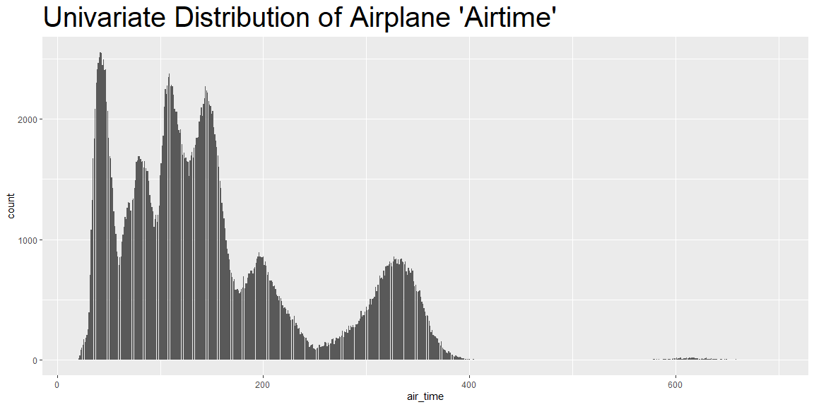
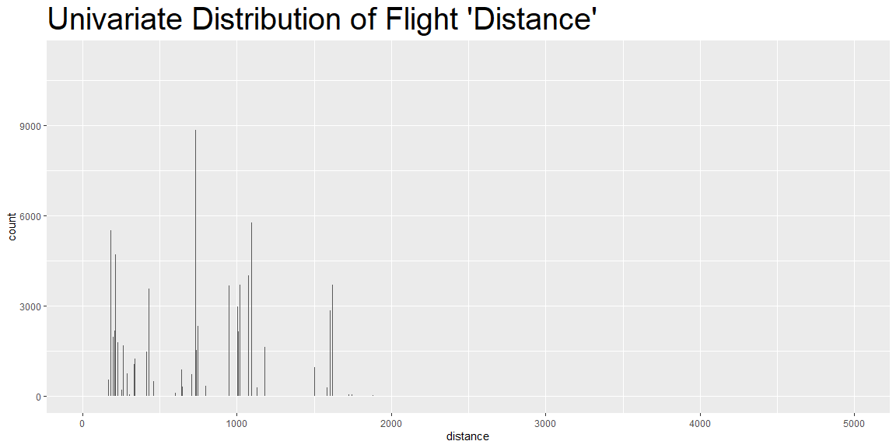
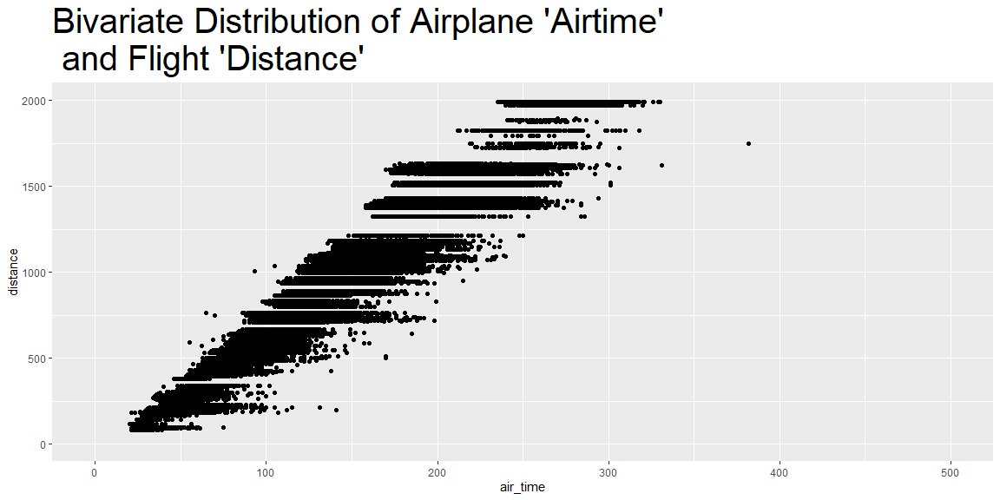

```r
# Use this R-Chunk to import all your datasets!
```

## Background

_Place Task Background Here_


## Data Visualization


```r
ggplot(data = flights) +
     geom_bar(mapping = aes(x = air_time), na.rm = TRUE)+
  ggtitle("Univariate Distribution of Airplane 'Airtime'")+
  theme(plot.title = element_text(size = 30))
```

<!-- -->

```r
ggplot(data = flights) +
     geom_bar(mapping = aes(x = distance), na.rm = TRUE)+
  ggtitle("Univariate Distribution of Flight 'Distance'")+
  theme(plot.title = element_text(size = 30))
```

<!-- -->

```r
ggplot(data = flights) +
    geom_point(mapping = aes(x = air_time, y = distance)) +
    coord_cartesian(xlim = c(0, 500), ylim = c(0, 2000))+
  ggtitle("Bivariate Distribution of Airplane 'Airtime' \n and Flight 'Distance'")+
  theme(plot.title = element_text(size = 30))
```

<!-- -->

## Summarizing Insights

|  I figured I would point out the things that surprised me about plotting this data. First, I expected the airtime distribution and the distance distribution to look somewhat similar. Which in some ways I guess it is similar, but right off the bat the distance distribution looks thinned out. After thinking about it for a moment, I assume this is likely because there are only so many places an airport can land. They have to go to an airport and that airport is always going to be the same distance away from the one they are currently at. 
|  Second, the bivariate distribution showed how the airtime will change even while going the same distance. We can see this from the line of dots that will appear on many of the distance measurements.This begs the question, why does the time in the air change so drastically when the distance is the same? It can vary anywhere from 20-100 minutes, sometimes even more. I'm not really sure what could cause a flight to change that much. Perhaps having to re-route around storms, could account for a large portion of it.     
